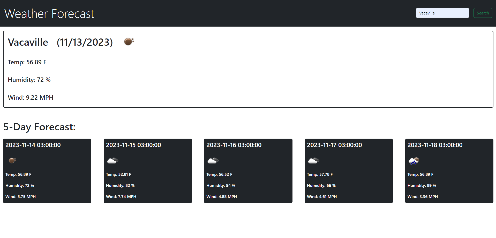

# Weather-Forecast

## Description

This Weather Forecast was created to be an alternative for users that don't want to get there weather updates via mobile phone whilst on there computers. It has all key features you would hope for out of a weather application and allows you to recieve real time updates anywhere in the world by simply typing in the name of a city. As someone who currently moved to the rocky mountain region I know how important it is to know what you're getting yourself into before you walk out of that front door.

This application was built using:

- HTML
- CSS
- JavaScript
- Bootstrap

## Installation

N/A

## Usage

Here is a list of some features this single page application has to offer:

- Worldwide weather updates
- Current real-time weather
- 5 day forecast predictions

## Credits

N/A

## License

Please refer to the LICENSE in the repo.

## Screenshot

